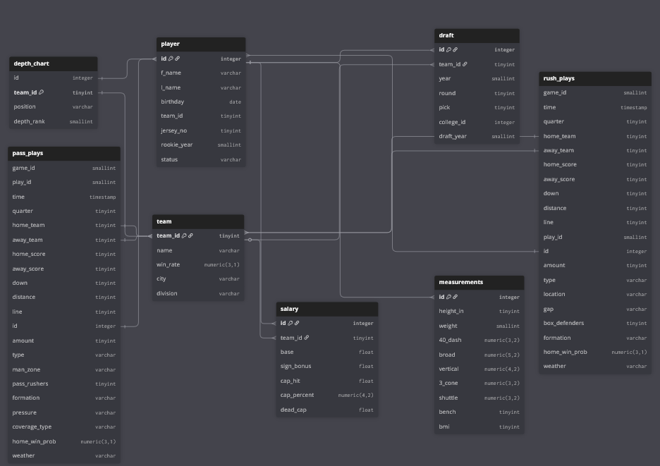

As a part of my Database Management class while in school, I was tasked with creating and maintaining an SQL database of my choice. Being a big sports fan, I decided to make a database consisting of information about all NFL players who recorded a stat in 2023, that most recent season. This is a breakdown of the process behind its creation, as well as some example queries

# Tables + Normalization

Even just for one season's worth of players, there is a tremendous amount of data to include, particularly with play-by-play data. The pbp dataset I pulled from nfl_data_py is far more wide than long, as it was designed for every play to be contained within one row. That means anything that can happen on a play gets its own column, resulting in a dataset with 397 columns, at least 30% of which will be null values on any given play. Knowing I wouldn't be able to capture every aspect of a play while following Normal Forms, I settled on 17 columns that tell you enough about the play to satisfy all but the most scrupulous of football fans. The key to it all are the columns "Stat" and "Amount". Using these 2 columns I can tell you just about everything that happened on a play.

### Example
Play ID 1 involves QB ID 7 completing a pass to WR ID 33 for 14 yards

| PLAY_ID | PLAYER_ID | STAT_TYPE | AMOUNT|
|---------|-----------|-----------|-------|
| 1      | 7          | completion| 1     |
| 1      | 7          | attempt   | 1     |
| 1      | 7          | pass_yards| 7     |
| 1      | 7          | air_yards | 4     |
| 1      | 7          |time_to_throw| 1.94 |
| 1      | 7          | epa       | .31   |
| 1      | 33         | target    | 1     |
| 1      | 33         | catch     | 1     |
| 1      | 33         | rec_yards | 7     |

In the original dataframe, each on of these stat types would have been its own column, and there would also be a column for the QB's ID and the receiver's ID. By reconstructing the DF in this way, both null values and excess columns have been kept to a minimum.

One last thing to note about the pbp table is that it has been split into 2, one for passing plays and one for running plays. This was done because, for all running plays, the defensive coverage is always a null value. Since I needed this for my passing plays, I split up the 2 and dropped those columns from the running plays table.

The process for the rest of my tables was pretty straightforward. Most of the information was readily available on nfl_data_py, and putting them all into tables was just a matter of running a few queries and merges. I included tables for players, which contains info such as jersey number, rookie year, and team id. The "Draft" and "Measurements" table include data from that player's draft info and combine performance, respectively. "Depth Chart" includes how many snaps each player played that week, and where that ranked them within their position group. "Salary" is the only table I couldn't get from nfl_data_py, instead having to webscrape from Spotrac. That table includes a player's salary for the 2023 season, broken down into their signing bonus, base salary, total cap hit, and dead cap if they were to be cut from the team. Finally, "Team" includes team name, city, winning percentage that season, and division. All tables are able to be merged onto one another through either the team_id column or the player_id column. Here is a screenshot of the database I put together with DBDiagram

